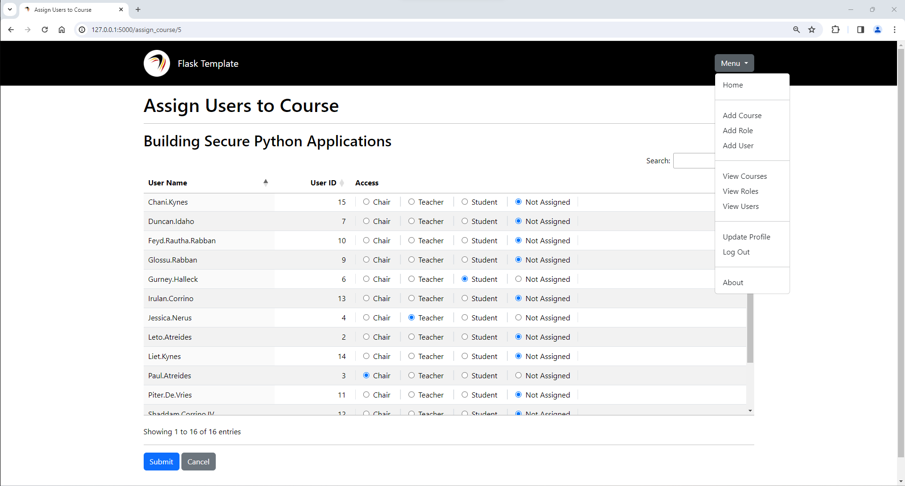

# Tracker

This demo is a feature-by-feature walkthrough of how to create and deploy a Flask application that allows you to control course assignments using role-based access control (RBAC).

-----

## Quick Start

To start:

1. Ensure you are using Python 3.8 or later: `python --version` or `python3 -V`. If not, install the latest version of Python available for your operating system.
2. Clone this repository: `git clone https://github.com/garciart/flask-demo`
3. Access the local repository: `cd flask-demo`
4. Create a Python virtual environment in the directory: `python -m venv $PWD/.venv`
5. Activate the Python virtual environment: `source .venv/bin/activate` (Linux) or `.venv/Scripts/activate` (Windows)
6. Install pip: `python -m pip install --upgrade pip`
8. Install required packages: `python -m pip install -r requirements.txt`
9. Each version of the **Tracker** application has its own package directory:
   - Review the `README.md` file in the first version directory using an editor of your choice: `tracker_01/README.md`
   - Run the application from the project directory using the directions in the `README.md` file: `python -B -m flask --app tracker_01 run`
   - Continue the next version.
