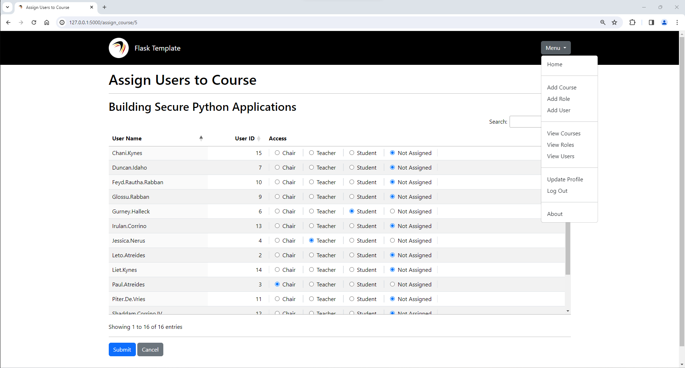

# Flask Template

This demo allows you to administer course access for students.



-----

## Roles

- ***Chair:*** Owns the course
- ***Teacher:*** Can administer a course
- ***Student:*** Can view a course

## Administration

Course Administration:

- ***Add a Course:*** Anyone; the creator becomes the Chair of the Course
- ***View Courses:*** Chairs, Teachers, and Students who are assigned to the Courses
- ***View a Course:*** Chairs, Teachers, and Students who are assigned to the Course
- ***Edit a Course:*** Chairs and Teachers who are assigned to the Course
- ***Delete a Course:*** Chairs who are assigned to the Course

Role and User Administration: Administrators only.

-----

## Setup the Test Database

```bash
# From the project root directory (e.g., ../flask-template)
python3 -m flask db init
python3 -m flask db migrate -m "Initial migration"
python3 -m flask db upgrade
python3 -m db_info.init_db
```

-----

## How to Run

```bash
# From the project root directory (e.g., ../flask-template)
python3 -m flask run
python3 -m flask --app app run
python3 -m flask --app app --debug run  # Allow hot reloads
```

-----

## How to Test

```bash
# From the project root directory (e.g., ../flask-template)
python3 -m unittest --verbose --buffer app.tests.test_app
```
