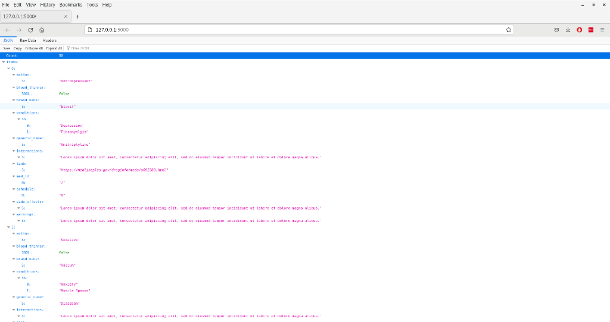

# Flask and DynamoDB Demo

## Steps:

Create the project and isolate the development environment:

**NOTE** - If you have a development directory in your home directory, use that instead (e.g., ```mkdir ~/Workspace/loc_flask_demo```, etc.).

```
mkdir ~/loc_flask_demo
cd ~/loc_flask_demo
git init
git branch -m main
python3.8 -m venv .venv
cd ~/loc_flask_demo
source .venv/bin/activate
wget https://raw.githubusercontent.com/github/gitignore/main/Python.gitignore --output-document=.gitignore
.venv/bin/python3.8 -m pip install --upgrade pip
pip install flask
pip install boto3
pip list --format=freeze > requirements.txt
git add --all :/
git commit -m "Initial commit."
git checkout -b devel
```

Configure AWS access:

```
pip install awscli --upgrade
aws configure
```

Enter the requested information when prompted:

```
AWS Access Key ID [None]: XXXXXXXXXXXXXXXXXXXX
AWS Secret Access Key [None]: XXXXXXXXXXXXXXXXXXXXXXXXXXXXXXXXXXXXXXXX
Default region name [None]: us-east-1
Default output format [None]: json
```

Create a directory to hold the data scripts:

```
mkdir -p ~/loc_flask_demo/data_scripts
cd ~/loc_flask_demo/data_scripts
```

In that directory, create scripts and populate the DynamoDB database:

**NOTE** - This will create only one record. For multiple records, you can download **create-table-meds.json**, and both **batch-write-items-meds-25.json** and **batch-write-items-meds-50.json**, from the repository instead. Remember, [AWS only accepts 25 item put or delete operations per batch.](https://docs.aws.amazon.com/amazondynamodb/latest/APIReference/API_BatchWriteItem.html "BatchWriteItem")

```
echo '{ "TableName": "medications", "KeySchema": [ { "KeyType": "HASH", "AttributeName": "generic_name" } ], "AttributeDefinitions": [ { "AttributeName": "generic_name", "AttributeType": "S" } ], "BillingMode": "PAY_PER_REQUEST" }' > create-table-meds.json
echo '{ "medications": [ { "PutRequest": { "Item": { "generic_name": { "S": "ACYCLOVIR" }, "brand_name": { "S": "ZOVIRAX" }, "action": { "S": "ANTIVIRAL" }, "conditions": { "SS": [ "HERPES", "COLD SORES" ] }, "schedule": { "N": "0" }, "blood_thinner": { "S": "FALSE" }, "side_effects": { "S": "Lorem ipsum dolor sit amet, consectetur adipiscing elit, sed do eiusmod tempor incididunt ut labore et dolore magna aliqua." }, "interactions": { "S": "Lorem ipsum dolor sit amet, consectetur adipiscing elit, sed do eiusmod tempor incididunt ut labore et dolore magna aliqua." }, "warnings": { "S": "Lorem ipsum dolor sit amet, consectetur adipiscing elit, sed do eiusmod tempor incididunt ut labore et dolore magna aliqua." }, "link": { "S": "https://medlineplus.gov/druginfo/meds/a681045.html" } } } } ] }' > batch-write-items-meds.json
chmod 666 *.json
aws dynamodb create-table --cli-input-json file://create-table-meds.json
aws dynamodb batch-write-item --request-items file://batch-write-items-meds.json
```

**OUTPUT:**

```
(env) [rgarcia@localhost loc_flask_demo]$ aws dynamodb create-table --cli-input-json file://create-table-meds.json
{
    "TableDescription": {
        "AttributeDefinitions": [
            {
                "AttributeName": "generic_name",
                "AttributeType": "S"
            }
        ],
        "TableName": "medications",
        "KeySchema": [
            {
                "AttributeName": "generic_name",
                "KeyType": "HASH"
            }
        ],
        "TableStatus": "CREATING",
        "CreationDateTime": 1667847213.294,
        "ProvisionedThroughput": {
            "NumberOfDecreasesToday": 0,
            "ReadCapacityUnits": 0,
            "WriteCapacityUnits": 0
        },
        "TableSizeBytes": 0,
        "ItemCount": 0,
        "TableArn": "arn:aws:dynamodb:us-east-1:XXXXXXXXXXXX:table/medications",
        "TableId": "XXXXXXXX-XXXX-XXXX-XXXX-XXXXXXXXXXXX",
        "BillingModeSummary": {
            "BillingMode": "PAY_PER_REQUEST"
        }
    }
}
(env) [rgarcia@localhost loc_flask_demo]$ aws dynamodb batch-write-item --request-items file://batch-write-items-meds-25.json
{
    "UnprocessedItems": {}
}
(env) [rgarcia@localhost loc_flask_demo]$ 
```

Continue to add items using **batch-write-item**. If DynamoDB returns any unprocessed items, check your JSON script and try again.

Save your work and update your requirements:

```
cd ~/loc_flask_demo
pip list --format=freeze > requirements.txt
git add --all :/
git commit -m "Created database in AWS DynamoDB."
```

Using an editor of your choice, create a file named **dynamodb_link.py**, in the repository's root directory, and add the following code:

```
resource = boto3.resource('dynamodb', region_name='us-east-1')

med_table = resource.Table('medications')


def get_items() -> object:
    """Gets all the data from the DynamoDB database.

    :return: The data from the DynamoDB database
    :rtype: dict
    """
    all_items = med_table.scan()
    return all_items['Items']
```

Create a file named **app.py**, in the repository's root directory, and add the following code:

```
@app.route('/')
def index() -> object:
    """Displays the landing page and data from the database

    :return: The page and content
    :rtype: object
    """
    items = db.get_items()
    return render_template('index.html', items=items)


if __name__ == '__main__':
    app.run()
```

Start the application:

```
flask run
```

Open a browser and navigate to http://127.0.0.1:5000/. You should see your data:



When you are ready to continue, close the browser, and, in the Terminal, press <kbd>Ctrl</kbd>+<kbd>c</kbd> to stop the Flask service.

Save your work and your requirements:

```
pip list --format=freeze > requirements.txt
git add --all :/
git commit -m "Tested on localhost."
```
