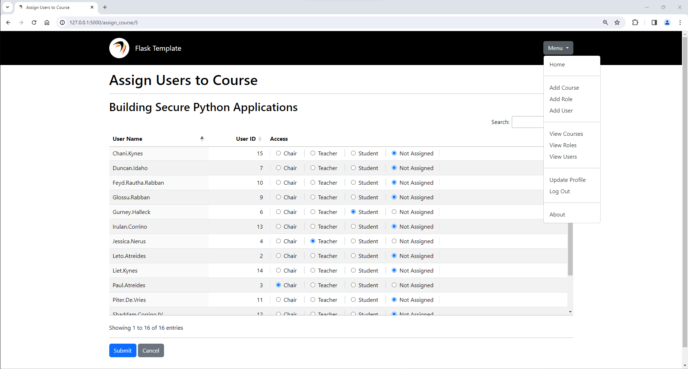

# Tracker

This demo is a feature-by-feature walkthrough of how to create and deploy a Flask application that allows you to control course assignments using role-based access control (RBAC).

-----

## Quick Start

To start:

1. Ensure you are using Python 3.8 or later: `python --version` or `python3 -V`. If not, install the latest version of Python available for your operating system.
2. Clone this repository to a local project directory: `git clone https://github.com/garciart/flask-demo`
3. Access the local project directory: `cd flask-demo`
4. Create a Python virtual environment in the directory: `python -m venv venv`
5. Activate the Python virtual environment: `source venv/bin/activate` (Linux) or `venv/Scripts/activate` (Windows)
6. Install pip: `python -m pip install --upgrade pip`
7. Install pylint: `python -m pip install pylint`
8. Install required packages: `python -m pip install -r requirements.txt`
9. Each version of the **Tracker** application has its own package directory:
   - Review the `README.md` file in the first version directory using an editor of your choice: `tracker_01/README.md`
   - Run the application from the project directory using the directions in the `README.md` file: `python -B -m flask --app tracker_01 run`
   - Continue the the next version.

-----

## Application Design

-----

### Business Problem

The Foo Academy is a fictitious learning platform that allows its members to create and share online courses, and it needs a way for members to control access to their courses. The Tracker application on the Academy's website allows content creators and assistants to manage access to their online courses using a role-based access control (RBAC) system as needed.

-----

### Desired Outcomes

As a company, I want to mitigate "Sybil Attacks" by preventing anonymous users from creating profiles.
As a company, I want to mitigate email flooding attacks by requiring anonymous users to use a form with a captcha when requesting membership.
As a company, I want to limit enrollment in a course to eight members to prevent users from overwhelming my limited information technology (IT) resources.
As a company, I want to restrict the ability to add members to administrators.

As an administrator, I want to add user profiles to the Tracker application.
As an administrator, I want to view user profiles on the Tracker application.
As an administrator, I want to edit user profiles on the Tracker application.
As an administrator, I want to delete user profiles from the Tracker application.

As a member, I want to view my user profile on the Tracker application.
As a member, I want to edit my user profile on the Tracker application.

As a content creator, I want to add my courses to the list of courses in the Tracker application.
As a content creator, I want to view the details of my courses on the Tracker application.
As a content creator, I want to assign members to my courses through the Tracker application.
As a content creator, I want to remove members from my courses through the Tracker application.
As a content creator, I want to edit the details of my courses on the Tracker application.
As a content creator, I want to delete my courses from the list of courses in the Tracker application.

As an editor, I want to view the details of the courses assigned to me on the Tracker application.
As an editor, I want to assign members to the courses assigned to me through the Tracker application.
As an editor, I want to remove members from the courses assigned to me through the Tracker application.
As an editor, I want to edit the details of the courses assigned to me on the Tracker application.

As a teacher, I want to view the details of the courses assigned to me on the Tracker application.
As a teacher, I want to assign members to the courses assigned to me through the Tracker application.
As a teacher, I want to remove members from the courses assigned to me through the Tracker application.

As a student, I want to view the details of the courses assigned to me on the Tracker application.

-----

### Stakeholders

Interested parties throughout the company will benefit from the Tracker application.

| Stakeholder    | Value from Application |
| -------------- | ---------------------- |
| Members        | Control access to their courses. |
| Administrators |  |
| Foo Academy    |  |

-----

### Personas

| Persona | Value from Application |
| ----------- | ---------------------- |
| Creators | |
| Editors  | |
| Teacher  | |
| Students | |

-----

+-----------------------------------+
|     course                        |
+-----------------------------------+
| PK  course_id       INTEGER NN UQ |<---1:N---|
+-----------------------------------+          |
|     course_name     TEXT    NN UQ |          |
|     course_code     TEXT    NN UQ |          |
|     course_group    TEXT          |          |
|     course_desc     TEXT          |          |
+-----------------------------------+          |
                                               |
+-----------------------------------+          |
|     role                          |          |
+-----------------------------------+          |
| PK  role_id         INTEGER NN UQ |<---1:N---|
+-----------------------------------+          |
|     role_name       TEXT    NN UQ |          |
|     role_privilege  INTEGER NN UQ |          |
+-----------------------------------+          |
                                               |
+-----------------------------------+          |
|     user                          |          |
+-----------------------------------+          |
| PK  user_id         INTEGER NN UQ |<---1:N---|
+-----------------------------------+          |
|     user_name       TEXT    NN UQ |          |
|     user_email      TEXT    NN UQ |          |
|     user_is_flagged INTEGER NN    |          |
|     user_flagged_by TEXT          |          |
|     password_hash   TEXT    NN    |          |
+-----------------------------------+          |
                                               |
+-----------------------------------+          |
|     association                   |          |
+-----------------------------------+          |
| PK  course_id       INTEGER NN    | FK -|    |
| PK  role_id         INTEGER NN    | FK -|<---+ (ON DELETE CASCADE, ON UPDATE CASCADE)
| PK  user_id         INTEGER NN    | FK -|
+-----------------------------------+

-----

Roles:
Administrator: Can remove users
Creator: Delete a course
Editor: Edit a course
Teacher: Can view all students and assign them to classes
Student: View own course

Only administrators can create an account. You cannot create your own account. You must contact an administrator to create your account.

DAVE (delete, add, view, edit)

User(username='Admin', user_email='admin@example.com', is_admin=True, flagged_for_del=False, flagged_by=null)

To delete an administrator, another administrator must flag the account for deletion first. Once flagged for deletion, another administrator cna delete the account.

Delete any user: Admin
Delete myself: Self
Add a user: Admin
View a list of all users: Admin, Creator, Teacher
View any user profile: Admin
View my user profile: Self
Edit any user profile: Admin
Edit my user profile: Self

Delete any course: Admin
Delete my courses: Admin, Creator
Add a course: Self
View a list of all courses: Admin
View the details of any course: Admin
View a list of my courses: Admin, Creator, Teacher, Student
View the details of my courses: Admin, Creator, Teacher, Student
Edit any course: Admin
Edit my courses: Admin, Creator, Teacher

Assign a student to any course: Admin
Assign a student to my courses: Admin, Creator, Teacher
Remove a student from any course: Admin
Remove a student from my courses: Admin, Creator, Teacher
Assign a teacher to any course: Admin
Assign a teacher to my courses: Admin, Creator
Remove a teacher from any course: Admin
Remove a teacher from my courses: Admin, Creator, Teacher

Cannot remove myself from one of my course: Creator

The site administrator can delete, add, view, and edit user accounts.

Anyone with an account can create a course.
The creator can view, edit, and delete the course.
The creator can assign teachers and students to the course.
The creator can unassign teachers and students to the course.

The teachers can view and edit the course.
The teachers cannot delete the course.
The teachers can assign students to the course.
The teachers can unassign students to the course.
The teachers cannot assign a teacher to the course.
The teachers cannot unassign a teacher from the course.

I can create a credential. I can also view, assign, edit, and  delete the credential.
I can assign editors who can edit the credential, but editors cannot delete it.
I can assign viewers who can view the credential, but viewers cannot edit or delete it.
Editors can also assign or unassign viewers.

The Tracker application itself allows you to administer course access for students.

-----

## Roles

- ***Chair:*** Owns the course.
- ***Teacher:*** Can administer a course.
- ***Student:*** Can view a course.

## Administration

Course Administration:

- ***Add a Course:*** Anyone; the creator becomes the Chair of the Course
- ***View Courses:*** Chairs, Teachers, and Students who are assigned to the Courses
- ***View a Course:*** Chairs, Teachers, and Students who are assigned to the Course
- ***Edit a Course:*** Chairs and Teachers who are assigned to the Course
- ***Delete a Course:*** Chairs who are assigned to the Course

Role and User Administration: Administrators only.